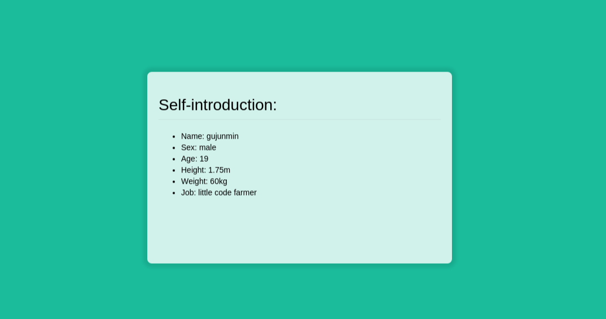

# Express4.13.1 Ajax JSON Grunt CSS3 JavaScript 实战练习(2015/9/10)

## The pictures of final results

## Knowledge Points

### Express

用这个框架也有几次了，这一次我其实只是借助于这个框架来学习其他的东西，我就改动模板引擎，使得ejs可以解析html后缀的文件：

1. 在app.js文件顶部引入ejs：

        ejs = require('ejs');
        
2. 注册模板引擎(有两总方式）：

        app.engine('html', ejs.__express);
        or
        app.engine('html', ejs.renderFile);

3. 设置默认引擎后缀：

        app.set('view engine', 'html');
        
4. 现在就可以使用html后缀的视图文件了。

### Grunt

这是我第一次入手 `grunt`, [grunt中文网站](http://www.gruntjs.net/ "grunt 官网")上面的教程写的十分的详细，但是对于新手而言个人认为还是比较抽象，还是边看官网上的教程，边看别人写的实例比较好入手，我大部分的文章都是在[segmentfault](http://segmentfault.com/ "segmentfault")上找到的，这是一个非常适合学习和分享的网站，没事可以多去逛逛。

这次我的 `Gruntfile.js` 文件故意在有些地方写的十分的复杂，为了更好的理解和学习。

#### Grunt API

##### 字符编码

`grunt.file.defaultEncoding`

设置此属性可以改变所有 `grunt.file` 方法的默认编码。默认是 `'utf8'`。如果必须改变这个值，建议你在Gruntfile文件中尽可能早改变。

    grunt.file.defaultEncoding = 'utf8';

##### 读文件

`grunt.file.read`

读取并返回文件的内容。返回值为一个字符串，如果 `options.encoding` 为 `null` ，则返回一个 `Buffer`。

    grunt.file.read(filepath [, options])

`options` 对象可以设置以下属性：

    var options = {
    // If an encoding is not specified, default to grunt.file.defaultEncoding.
    // If specified as null, returns a non-decoded Buffer instead of a string.
    encoding: encodingName
    }; 

`grunt.file.readJSON`

读取一个文件的内容，将其按照 `JSON` 格式解析，返回结果。参见 `grunt.file.read` 获取其所支持的参数列表。

    grunt.file.readJSON(filepath [, options])

### JSON

这是我第一次使用 `JSON` 来交换数据，以前使用过它来写 `shadowsock` 翻墙的配置文件 `1080.json` ,感觉这和 `javascript` 中的对象字面量表示法十分的类似，但是我现在毕竟还是第一次使用，只学习了一点皮毛，所以还有很多的区别有待进一步学习。

以下的知识点总结都是摘至[廖雪峰老师的javascript教程](http://www.liaoxuefeng.com/wiki/001434446689867b27157e896e74d51a89c25cc8b43bdb3000/001434499490767fe5a0e31e17e44b69dcd1196f7ec6fc6000)，个人认为写得非常的好，知识面非常的广。

#### JSON简介

在2002年的一天，道格拉斯·克罗克福特（Douglas Crockford）同学为了拯救深陷水深火热同时又被某几个巨型软件企业长期愚弄的软件工程师，发明了JSON这种超轻量级的数据交换格式。

道格拉斯同学长期担任雅虎的高级架构师，自然钟情于JavaScript。他设计的JSON实际上是JavaScript的一个子集。在JSON中，一共就这么几种数据类型：

`number`：和JavaScript的number完全一致;  
`boolean`：就是JavaScript的true或false;  
`string`：就是JavaScript的string;  
`null`：就是JavaScript的null;  
`array`：就是JavaScript的Array表示方式——[];  
`object`：就是JavaScript的{ ... }表示方式。  
以及上面的任意组合。

并且，`JSON` 还定死了 **字符集** 必须是 `UTF-8` ，表示多语言就没有问题了。为了统一解析，**`JSON` 的字符串** 规定必须用双引号 `""`，**`Object`的键** 也必须用双引号 `""`。

#### javascript内置JSON解析API

以下API详细讲解请参见[廖雪峰老师的javascript教程](http://www.liaoxuefeng.com/wiki/001434446689867b27157e896e74d51a89c25cc8b43bdb3000/001434499490767fe5a0e31e17e44b69dcd1196f7ec6fc6000)。

##### 序列化

`JSON.stringify()`

##### 反序列化

`JSON.parse()`

### Ajax

这也是我第一次使用原生的 `ajax`,以前使用的都是 `jQeury` 提供的一些封装了的接口，其实这并不是我第一次学习 `ajax`, 以前就看过教程，但是实在是无法理解，后来慢慢的，慢慢的，就理解了，相信很多人都有这种感觉--每次学习新的东西的时候，总是感觉十分的难以理解，但是多遍反复的学习并随着时间的推移，渐渐的你就会发现你开始理解了。

以下的内容摘至[w3school教程](http://www.w3school.com.cn/ajax/ajax_xmlhttprequest_send.asp)。

##### 创建XMLHttpRequest对象

所有现代浏览器（IE7+、Firefox、Chrome、Safari 以及 Opera）均内建 XMLHttpRequest 对象。

创建 XMLHttpRequest 对象的语法：

    variable=new XMLHttpRequest();

老版本的 Internet Explorer （IE5 和 IE6）使用 ActiveX 对象：

    variable=new ActiveXObject("Microsoft.XMLHTTP");
    
##### 请求

详细的配置请参见 [w3school教程](http://www.w3school.com.cn/ajax/ajax_xmlhttprequest_send.asp)。

`open(method,url,async)`

`send(string)`

##### 响应

`onreadystatechange` 事件

`readyState`

`status`

`responseText`

在 `onreadystatechange` 事件中，我们规定当服务器响应已做好被处理的准备时所执行的任务。
当 `readyState` 等于 4 且状态为 200 时，表示响应已就绪。

### CSS3

我到目前为止还没有正式的学习 `CSS3`，现在也只是需要什么我就去翻阅什么，目前这段时间我主要是在学习 `javascript/node.js`, 估计也要到过一段时间才能去正式的学习了。这次使用 `CSS3` 是用在加载内容之前，本来打算制作成一个加载 *梅花转*， 此动画学习于 [幕课文章](http://www.imooc.com/article/1246)，但是实际效果做出来之后，我自己都不忍直视了。。。后面又学习了一个酷炫的效果，来自于一个外国人写的 [加载效果](http://tobiasahlin.com/spinkit/)，加上背景颜色，简直帅呆了。

以下内容摘至 [w3school教程](http://www.w3school.com.cn/css3/)。

##### border-radius 属性用于创建圆角：

    border-radius: 1-4 length|% / 1-4 length|%;
    
需要注意的是斜线两边的内容，一般情况下只设置左边的值，右边的值与左边的值等同。斜线两边值的含义:  

- 斜线左边定义的是圆角水平的半径值。
- 斜线右边定义的是圆角垂直的半径值。

##### 2D 转换

- scale() 方法

    通过 `scale()` 方法，元素的尺寸会增加或减少，根据给定的宽度（X 轴）和高度（Y 轴）参数：

        transform: scale(2,4);

    由于浏览器的兼容性问题，所以需要特殊的前缀，具体的配置就参见 [w3school教程](http://www.w3school.com.cn/css3/css3_2dtransform.asp) 吧。

- translate() 方法

    通过 `translate()` 方法，元素从其当前位置移动，根据给定的 left（x 坐标） 和 top（y 坐标） 位置参数：
    
        transform: translate(50px,100px);

##### 动画

`@keyframes` 规则用于创建动画。在 @keyframes 中规定某项 CSS 样式，就能创建由当前样式逐渐改为新样式的动画效果。

当您在 @keyframes 中创建动画时，请把它捆绑到某个选择器，否则不会产生动画效果。
通过规定至少以下两项 CSS3 动画属性，即可将动画绑定到选择器：

- 规定动画的名称
- 规定动画的时长

这个也要考虑浏览器的兼容性问题，需要特殊的前缀。

##### 过渡

CSS3 过渡是元素从一种样式逐渐改变为另一种的效果。

要实现这一点，必须规定两项内容：

- 规定您希望把效果添加到哪个 CSS 属性上
- 规定效果的时长

### Javascript

学习 `js` 也有几个月的时间了，还记得第一次接触

##### 转换数字为字符串

之所以我这里会提到这种方法的原因是当我在使用 `DOM` 改变元素内容的时候我首先使用的是如下的代码：

    document.getElementById("one").innerHTML = 5;

后面一直运行不了，我就醉了，拥有 **黑客精神** 的我，找啊找，首先怎么找也找不到，搞了很久也没有搞出来，第二天接着搞，重写了一下代码，发现了，要将数字转换为字符串。。。

转换变量为值为字符串有两种方式：

- variable.toString()
- String()

区别在于如果变量的值是 `null` 或者是 `undefined` 的时候，就没有 `toString` 方法，而 `String` 可以转换任意的值为字符串，因此我选择在任意的时候选择使用第二种方式。

    var num = 10;
    String(num);

##### HTML DOM 访问

访问 HTML 元素：

- 通过使用 `getElementById()` 方法
- 通过使用 `getElementsByTagName()` 方法

##### 定时器

以前刚接触这个东西的时候，都是照着教程代码写，毕竟刚入门编程，什么都不懂，现在的我就不会了，一般会自己再想个东西用同样的方式来把这个方式实现一遍，只有这样才能真真的掌握这个东西。这个定时器太坑了，有人在 [StackOverflow](https://stackoverflow.com/questions/3800512/calling-functions-with-settimeout/3800518#3800518) 已经解决这个问题了，并且解释的非常的详细，我偷偷懒吧 :）。

简单的语法：

    var t=setTimeout("javascript语句",毫秒)
    clearTimeout(setTimeout_variable)
    

## Summary

代码都写在 `public/` 这个目录之下，就只有 `app.js` 改动了一下默认的模板引擎，还有一个 `Gruntfile.js` 文件，其中都有个人认为还比较详细的代码，欢迎吐槽，指正。

代码结构图：

nodejs-demo/  
├── app.js  
├── bin  
│   └── www  
├── Gruntfile.js  
├── node_modules  
├── package.json  
├── public  
│   ├── images  
│   │   └── favicon.png  
│   ├── javascripts  
│   │   ├── dest  
│   │   └── src  
│   └── stylesheets  
│       ├── dest  
│       └── src  
├── routes  
│   ├── index.js  
│   └── users.js  
└── views  
    ├── error.ejs  
    ├── footer.html  
    ├── header.html  
    ├── index.ejs  
    └── index.html  
    
我只能说我是个苦逼的娃啊，学校学业太重了，只能抽一些零零碎碎的时间来写代码，我感到十分的伤心，上次竟然因为翘课被抓到了办公室去审讯，我顿时就无语凝烟了，再加上这次练习的东西大部分是对我比较陌生的东西，这个东西花了一个星期，包括如下内容：

- 几次重新构思，因为前几次实在是太丑了，我自己都看不下去了
- Google 资料
- 总结

个人觉得这个东西做的还不是十分的好，有待进一步的改进，不过这是第一次，还是表扬一下自己，加油:)
